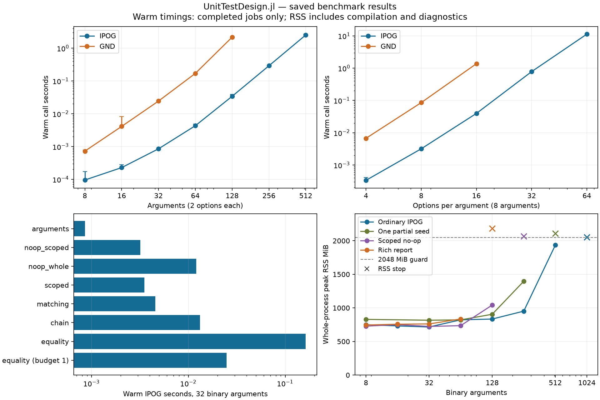

# UnitTestDesign performance study: October 3, 2026

The library handles ordinary pairwise suites with dozens of arguments well,
but its cost depends strongly on how rules and workflows are expressed.
IPOG remains a good default in these measurements. More compact engines can
save expensive test executions; reducing allocation and improving feasibility
or evidence handling address different bottlenecks.

Across five serial studies, 324 job specifications produced 293 `ok`
results, ten RSS stops, five timeouts, eight library/search resource-limit
outcomes, and eight jobs skipped after earlier ladder limits. All raw data,
including completed calls inside censored jobs, are preserved. The
[combined CSV](results/all_measurements.csv) supports further analysis.

This report includes the completed 245-job main study:
[raw results](results/20261003-m2-v2/results.json) and
[all measured rows](results/20261003-m2-v2/summary.md).
It records 230 successful jobs, two RSS stops, three stage timeouts,
four resource-limit outcomes, and six larger cases skipped after an earlier
ladder limit, plus the 57-job focused study described below. Separate
phase/heap-hint evidence is described below. Numbers below are three-run warm
medians unless marked cold or censored. The machine reports Apple M2, 24 GiB physical memory,
Julia 1.13.1, and one Julia thread. This run uses a 2,048 MiB process RSS
guard, 20-second warm-stage guard, 60-second first-call/setup guard, and
100,000 search nodes per feasibility question. That node budget is lower
than the production API's default of one million; follow-up budget runs
must be kept distinct from the main ladder's limits.

The generation figures include request construction, target classification,
generation, built-in certification, and public case conversion for reused
spaces. They exclude initial space construction. Cold figures include
compilation triggered by that operation, but exclude Julia process startup
and package loading. RSS covers the whole process, including setup,
compilation, diagnostics, and every repetition. These are workstation
measurements with ordinary background memory use, not an uncontended laboratory
baseline; small timing differences should not be overinterpreted. The 2 GiB
RSS guard intentionally protects headroom for the user's other work. A stop
at that guard is not exhaustion of the laptop's full 24 GiB, and the sampled
guard can overshoot briefly between 0.2-second polls.
The initial `vm_stat` snapshot showed about 190 MiB of free pages and
8.4 GiB occupied by the memory compressor, with substantial inactive/cache
pages as well. Free pages alone do not determine usable RAM; these numbers
explain the conservative budget and are not a claim of an idle machine.

Figure: Apple M2, Julia 1.13.1. Timing error bars span the three warm calls;
crosses in the memory panel mark censored RSS stops, and the dashed line is
the configured guard. Censored times are omitted from the timing curves.
The [SVG version](results/overview.svg) is available for reuse.

## What was measured and verified

The suite varies argument count, homogeneous and mixed option counts,
interaction strength, several rule scopes and topologies, explanation
budgets, and realistic API workflows. IPOG is deterministic. GND uses a fresh
seed 0 and 50 candidates per generated row; a separate ladder uses ten
candidates. Every measured job has its own process and runs serially.
Small jobs precede larger ones within each ladder. Internal per-question
budgets supplement external wall-time/RSS watchdogs, and failed ladders stop
before proceeding to larger cases. [The harness guide](README.md) documents
the grids, commands, metrics, adapter contract, and replay fingerprints.

One first model construction and three warm fresh constructions are recorded
separately. A first operation then precedes three warm operations, with a
full garbage collection before each. Audit, report, top-up, upgrade, export,
and realization jobs first prepare cases and preserve them during the measured
operation; preparation is recorded separately. Their cold operation can reuse
methods compiled during preparation. It is therefore a first workflow call,
not a measurement of every cost of a new Julia session.

Every completed built-in covering generation includes certification of row
validity and required coverage. Forty-three small ordinary study jobs (41
main, two follow-up) also pass an
independent exhaustive oracle over the full valid product, checking domain
membership, required interactions, and must-include preservation. Six small
partition/invalid jobs pass additional public coverage checks. Oracle work is
outside generation timing. Large jobs rely on production certification rather
than independently enumerating their full products. No timing threshold is
used as a correctness assertion.

| Evidence | What it measures and what it does not |
|:--|:--|
| Warm elapsed/GC | Measured call with its certification; excludes preceding explicit GC and following diagnostic traversal |
| Cold elapsed | Compilation triggered by the first operation, after package load, model construction, and any preparation |
| Allocated bytes | Cumulative allocation over a call; does not describe simultaneous live memory |
| Returned `summarysize` | Reachable result objects, including its evidence and space where applicable; does not include all transient state |
| Search `summarysize`/counters | Primary ordinary feasibility context; excludes some generation state, negative contexts, and explanation deletion trials |
| Peak RSS | All resident memory in the process over setup, calls, compilation, and diagnostics; OS high-water mark preferred, sampled peak used when unavailable |
| Sampled stage RSS | Approximate attribution at polling intervals, carrying earlier compilation/setup memory |
| Whole-job wall | Startup, package loading, setup, all repetitions, diagnostics, and verification |

This distinction matters even for the word "core": its `Request + generate`
measurement includes request normalization, classification, solving, and final
certification. It excludes public `TestCases` conversion, but is not the
algorithm stripped of the package's semantic guarantees.

Compilation is practical user cost. The twelve-argument, three-option IPOG
triple design takes 5.01 seconds on its recorded cold operation versus
0.00628 seconds warm. Microsecond-to-millisecond generation figures describe
already compiled methods; a fresh unit-test process can spend much more on
first use. The full process wall time records additional startup/loading
costs. Saving generated cases as committed data can avoid repeatedly paying
these costs when the model remains stable.

## Argument count: tiny suites can require substantial generator work

| Binary arguments | Pair targets | IPOG cases | IPOG warm seconds | GND cases | GND warm seconds |
|--:|--:|--:|--:|--:|--:|
| 8 | 112 | 9 | 0.0000956 | 8 | 0.000726 |
| 32 | 1,984 | 13 | 0.000854 | 12 | 0.0244 |
| 64 | 8,064 | 15 | 0.00432 | 14 | 0.170 |
| 128 | 32,512 | 17 | 0.0341 | 17 | 2.16 |
| 256 | 130,560 | 19 | 0.291 | 19 on the completed cold call | Warm stage timed out |
| 512 | 523,264 | 21 | 2.52 | Not attempted after earlier limit | — |
| 1,024 | 2,095,104 | RSS stop during cold operation | — | Not attempted | — |

The target count is `binomial(n, 2) × 2²`. Increasing argument count does
not force the final suite to resemble the enormous full product. Here IPOG
grows from nine cases at eight arguments to twenty-one at 512 arguments.
However, doubling 256 to 512 arguments multiplies the target count by about
4 and warm time by 8.68. The recent IPOG doublings show approximately cubic
time/allocation growth over this measured range; that is an observation of
this implementation, not a general complexity theorem.

At 128 arguments GND takes 63.5 times IPOG's generation time and returns
the same seventeen cases. At 256 arguments GND completed a cold call in
35.9 seconds with nineteen cases, then exceeded the 20-second warm-stage
guard. There is no completed warm estimate for that job. The 1,024-argument
IPOG RSS stop is a boundary under our conservative 2 GiB process cap, not
proof that it cannot run on a 24 GiB machine with a larger allowance.

## Option count: both generator cost and test execution grow

| Arguments × options | Pair targets | IPOG cases / seconds | GND cases / seconds |
|:--|--:|--:|--:|
| 8 × 4 | 448 | 28 / 0.000335 | 27 / 0.00670 |
| 8 × 8 | 1,792 | 103 / 0.00317 | 93 / 0.0853 |
| 8 × 16 | 7,168 | 256 / 0.0396 | 344 / 1.37 |
| 8 × 32 | 28,672 | 1,991 / 0.780 | 1,298 on cold call / warm timeout |
| 8 × 64 | 114,688 | 7,168 / 11.3 | Not attempted after earlier limit |

For a uniform unconstrained space, any one pair of arguments requires every
`v²` assignment, and a case covers only one assignment for that pair. Thus
`v²` is an elementary lower bound on case count. IPOG reaches this bound
at sixteen options: 256 cases. GND is both slower and larger there. At
thirty-two options IPOG is about 1.94 times that lower bound; at sixty-four
options it is 1.75 times the bound. These are opportunities for a more compact
design, although the bound alone does not establish an achievable optimum.

Doubling options from 32 to 64 quadruples target count but multiplies IPOG
time by 14.5. Its 64-option call allocates 51.5 GiB cumulatively while the
whole-process RSS peak is only 901 MiB. That large allocation figure describes
repeated transient work, not a requirement for fifty gigabytes of RAM.

A single large domain is quite different from uniformly large domains.
Sixteen arguments with 256 options only for the first argument, and two for
each other argument, have `binomial(15,2) × 4 + 15 × 256 × 2 = 8,100` pair
targets. IPOG returns 512 cases in 0.0773 seconds; GND also returns 512 but
takes 2.90 seconds. The mandatory largest pair already requires 512 rows,
so both attain this elementary lower bound. Domain-size distribution matters
more than quoting only the largest number of options.

## Strength: a modest parameter list can still be expensive

| Strength, 12 arguments × 3 options | Target count | IPOG cases / seconds | GND cases / seconds |
|--:|--:|--:|--:|
| 2 | 594 | 20 / 0.000354 | 17 / 0.00619 |
| 3 | 5,940 | 74 / 0.00628 | 68 / 0.224 |
| 4 | 40,095 | 267 / 0.137 | 244 / 5.90 |
| 5 | 192,456 | 918 / 1.93 | Cold operation timed out |

Targets grow as `binomial(n, strength) × options^strength`. GND makes designs
8.1% smaller at strength 3 and 8.6% smaller at strength 4, while taking
35.7 and 43.0 times as long to generate them. This can still be a useful
trade when the function under test is expensive.

For example, at strength 4 let one test case cost `C` seconds. The warm
total-time comparison is `0.137 + 267C` for IPOG versus `5.899 + 244C` for
GND. GND breaks even at `(5.899 - 0.137) / 23 = 0.251` seconds per case.
At one second per test it saves about seventeen seconds overall; at one
millisecond per test IPOG is substantially faster overall. With the recorded
cold generation times, 5.168 versus 10.548 seconds, the corresponding
threshold is about 0.234 seconds per case. Process startup, unrelated test
setup, and reuse of a committed design change the practical comparison.

## Rules: writing the same condition differently changes the problem

Forbid `(p1=1, p2=1)` over sixteen binary arguments:

| Rule scope | IPOG cases / seconds | GND cases / seconds |
|:--|--:|--:|
| Explicitly names `p1,p2` | 9 / 0.000622 | 10 / 0.00508 |
| Whole-case function reading those same two fields | 9 / 0.258 | 10 / 0.788 |

Whole-case writing slows IPOG by 414 times and GND by 155 times, with the
same valid space and the same case counts. At 32 arguments both engines
reach the 100,000-node feasibility limit when classifying `(p1=1,p2=1)`;
generation returns no incomplete suite.

The package knows a scoped rule is already violated as soon as its two
arguments are assigned. A whole-case rule declares every argument in its
scope, so proving this target impossible requires searching completions
until late checks reject them. The whole-case exclusion is also classified
as implied rather than direct. This is an important user-facing performance
affordance: declaring scope accurately can matter more than changing the
covering algorithm.

For this rule, the scoped API is
`forbid((a,b) -> a == 1 && b == 1, :p1, :p2)`; the named pattern
`forbid((p1=1,p2=1))` and macro `@forbid(p1 == 1 && p2 == 1)` also preserve
that narrow scope.

Even a whole-case rule that always returns false incurs a cost without
changing what is valid. At 64 binary arguments IPOG rises from 0.00432 to
0.120 seconds, 27.8 times slower, with fifteen cases in both calls. GND
rises from 0.170 to 1.36 seconds, eight times slower, with fourteen cases
in both. Its request retains about 335 MiB of primary feasibility state,
including 86,609 lazy-rule verdicts, and the process reaches 1,763 MiB RSS.
That is real live state despite a returned result of only about 0.019 MiB.

Topology matters too. The 64-argument local-forbid matching takes IPOG
0.0276 seconds; the connected chain takes 0.117 seconds, 4.25 times as
long. The matching has 32 rules and the chain 63, and their valid spaces
and generated case counts differ, so this does not isolate topology alone.
It does show that cheap individual two-argument predicates need not compose
into equally cheap workloads.

A genuinely global rule is not automatically intractable. The bounded-sum
family forbids `sum(values(case)) > n + n÷2`. At sixteen binary arguments
all 480 pair targets remain feasible: IPOG produces eleven cases in 1.98 ms,
and GND ten in 45.8 ms. This family was tested only at eight and sixteen
arguments. Finding a completion is often easy here; proving that a fixed
partial assignment has no completion can be much harder, as the equivalent
whole-case exclusion and pigeonhole families demonstrate.

## Explaining exclusions can dominate a two-case design

The equality-chain family requires all 64 binary arguments to agree. Its
entire valid space consists of two rows, yet classification must account
for 8,064 pairs: 4,032 feasible, 126 directly forbidden, and 3,906 implied
exclusions.

| IPOG explanation budget | Cases | Warm seconds | Cumulative allocation | Returned result size | Whole-process RSS |
|--:|--:|--:|--:|--:|--:|
| 1,000,000 | 2 | 2.72 | 8.38 GiB | 4.34 MiB | 816 MiB |
| 1 | 2 | 0.207 | 0.476 GiB | 10.97 MiB | 829 MiB |

Reducing the explanation budget makes this workload 13.1 times faster and
cuts cumulative allocation by 17.6 times. Both calls prove the same targets
infeasible and return the same complete two-case design. What changes is
attribution: all 3,906 implied exclusions have verified inclusion-minimal
rule sets in the first call and unresolved minimality in the second.
The recorded primary feasibility counters are identical; deletion trials
are not aggregated into those counters, so counters alone would miss this
large saving.

The cheaper explanation is not cheaper in every memory metric: its returned
result is 2.53 times larger. It retains broad sufficient rule sets rather
than reducing them to smaller minimal sets. RSS also does not decline in
these jobs. Faster generation, less transient allocation, smaller returned
evidence, and lower process RSS are separate goals.

## Tabulation: reusable spaces amortize more than value normalization

The six-argument scoped resource rule forbids sums greater than twelve, over
four-valued arguments. Its scope has 4,096 assignments. At sixteen total
arguments, tabulation and forced-lazy evaluation return the same 59-case
IPOG design, with all 1,920 pairs feasible.

| IPOG rule policy | Warm space construction | Warm generation | Space retained size |
|:--|--:|--:|--:|
| Tabulated | 1.84 ms | 5.54 ms | 0.769 MiB |
| Forced lazy | 0.162 ms | 7.74 ms | About 4 KiB |

Tabulation spends more upfront and retains a larger reusable rule table,
while the measured generation is 1.40 times faster. Construction plus one
generation is about 7.38 versus 7.90 ms here, so even that single warm use
slightly favors tabulation. Reuse increases the benefit. This example uses a
cheap predicate; expensive predicates or much larger scopes change the trade.
Whole-case rules remain lazy regardless of this threshold.

Pattern, macro, explicitly scoped function, and forced-lazy two-argument
forms produce the same mathematical exclusion and comparable sub-millisecond
IPOG times at sixteen arguments. Their small differences should not drive API
choice; specifying a narrow scope accurately is the material distinction.

## Public workflows: the evidence requested can cost more than the design

For 64 binary arguments, these IPOG operations start with the same basic
pairwise space. Analysis operations use prepared cases and exclude their
preparation from the times shown.

| Operation | Measured outcome | Warm milliseconds |
|:--|:--|--:|
| Core request/generation/certification | 15 cases | 4.02 |
| Public generation on existing space | 15 cases | 4.18 |
| Public named domains, rebuilding space | 15 cases | 4.35 |
| Public positional domains | 15 cases | 4.46 |
| One partial must-include row | 15 cases | 6.17 |
| Pairwise plus triples within first six arguments | 15 cases; 8,224 requested targets | 6.30 |
| Coverage of prepared full suite | 8,064 pairs complete | 1.29 |
| Coverage of first seven rows | 7,397 pairs covered, 667 missing | 2.61 |
| Coverage of no rows | 8,064 missing pairs returned | 16.1 |
| Top up the first seven rows | 15 final cases, original rows preserved | 4.35 |
| Upgrade prepared pairs to global triples | 45 final cases, original 15 preserved | 623 |
| Rich report on prepared pairs | Pair coverage plus triple bonus and prefix curve | 192 |
| Collect prepared cases | Plain vector of cases | 0.00492 |
| Iterate and sum their values | Reads every returned value | 0.0333 |
| Export GitHub matrix | Serializable CI configurations | 0.593 |

Named representation and ordinary public conversion add modest costs on
this workload. The reported core/public times come from separate processes,
so their small difference is not a precise phase decomposition. The much
larger costs belong to stronger requirements and evidence work, not merely
to naming arguments or looping over the cases.

Mixed strength is a useful affordance: the first-six-argument triple group
adds 160 triple targets to the 8,064 base pairs. This run still uses fifteen
cases. Preserving existing cases during a global triple upgrade requests
333,312 targets and yields forty-five cases; the measured time is 0.623
seconds and cumulative allocation 2.27 GiB, with 1,415 MiB process RSS.
Fresh global-triple generation at this same width was not measured; the
upgrade numbers demonstrate preservation costs, not an advantage over fresh
generation.

Rich reporting is especially significant. At 64 arguments `report` costs
0.192 seconds, about 149 times the simple complete-coverage audit and 44.5
times pair generation. It computes bonus coverage over 333,312 triples:
290,230 covered, in addition to checking all 8,064 pairs. At 128 arguments
generation succeeds in 0.0341 seconds and simple coverage in 0.00614 seconds,
but the rich report crosses our 2 GiB guard during its first call. There are
2,731,008 possible binary triples at that width. A new generation engine
alone would not make this reporting workload affordable.

Returning evidence about gaps has a cost too. The empty audit is roughly
12.5 times slower than auditing the full prepared suite at 64 arguments and
allocates about 49.8 MiB versus 4.28 MiB. Its API returns explicit missing
interactions, whereas a complete audit has none. Running fewer user tests
does not necessarily mean cheaper analysis.

## Values and alternative strategies

Partitions choose named classes during generation; realization then draws
actual values. At 32 arguments, two partitions per argument give thirteen
cases in 0.000844 seconds, close to the integer design's 0.000854 seconds.
At 64 arguments realization of the fifteen generated cases costs 0.000148
seconds. The benchmark's draws return simple integers; expensive sampling or
large concrete objects are outside this claim. Measure coverage on labels,
and keep labels beside the realized inputs.

One invalid value in every domain adds a genuine separate negative-testing
requirement. At 32 binary arguments IPOG grows from thirteen ordinary cases
to seventy-seven total cases and from 0.000854 to 0.00483 seconds. The result
covers 1,984 ordinary and 1,984 negative pair targets. Each negative row may
hold exactly one invalid value, and rules involving its invalid parameter
are skipped by the documented negative policy. The larger suite is the cost
of additional requested evidence, not a degradation of ordinary coverage.

Full factorial succeeds at sixteen binary arguments with 65,536 rows in
0.152 seconds. At twenty arguments it refuses the 1,048,576 candidates
because the public row limit is one million. That is a configured row-count
limit, not a measured timeout or memory failure. Raising the limit should be
preceded by smaller-job memory evidence.

Distance-two excursions around a binary base produce
`1 + n + binomial(n,2)` rows: 2,081 at 64 arguments in 0.0201 seconds and
8,257 at 128 in 0.133 seconds. These cases answer which changes near a base
are troublesome. These particular unconstrained binary rows also cover all
pairs, but the excursion API generally promises a neighborhood around a base
rather than requested global interaction coverage. Constraints and other
models can make those guarantees differ. Choose the strategy according to
the question before comparing speed.

## Backtracking: finding a witness and proving none exists differ sharply

The all-different ladder uses `q` values per parameter, with a binary rule
forbidding equal values for every pair. With `q` parameters it is satisfiable;
with `q+1` parameters it is unsatisfiable by pigeonhole reasoning. These jobs
measure one ordinary feasibility query on an empty assignment, not full
test generation and not an independent comparison between IPOG and GND.
Both covering engines share this feasibility machinery.

| Values `q` | Satisfiable warm query | Unsatisfiable warm query | Unsatisfiable search outcome |
|--:|--:|--:|:--|
| 5 | 0.0173 ms | 0.0981 ms | Proven infeasible |
| 6 | 0.0178 ms | 0.418 ms | Proven infeasible |
| 7 | 0.0195 ms | 2.93 ms | Proven infeasible; 13,699 nodes |
| 8 | 0.0228 ms | 21.1 ms | Unknown after 100,000 nodes |
| 9 | 0.0264 ms | Skipped | Earlier unsatisfiable ladder limit |

The unknown at eight values is deliberate budget behavior. Its 21.1 ms
records a completed bounded search, not the time to prove unsatisfiability.
The next larger unsatisfiable problem was not run under the same ladder.
The existing search uses forward checking and tries values in domain order;
binary constraints do not give it a global all-different proof at the root.
A solver with stronger propagation is therefore a plausible candidate for
such constraint families. Higher-budget follow-up measurements below show
how quickly the current backend reaches a proof when given more nodes.

## Tuning the existing GND engine

On 64 unconstrained binary arguments, reducing GND's candidate pool from
fifty to ten reduces generation from 0.170 to 0.0383 seconds, a 4.43-fold
speedup. It increases the design from fourteen to fifteen cases. IPOG still
generates fifteen in 0.00432 seconds. Candidate tuning is worthwhile if GND
is otherwise the preferred algorithm, but it does not make this tuned GND
competitive with IPOG on the measured generation-only workload.

At strength 4 the default GND comparison above can be justified by expensive
test execution. Different candidate counts and seeds may find other compact
designs; the current numbers concern the recorded fixed seeds rather than
a distribution of every possible GND run.

## Memory and the solver decision

The 512-binary-argument IPOG job illustrates three distinct scales: a 0.165
MiB returned result, about 1.89 GiB process peak RSS, and 15.46 GiB of
allocation over one warm call. Its warm GC median is about 0.915 seconds
against 2.52 seconds elapsed. Allocation reduction may improve performance
and headroom without altering the generated design. Source inspection also
shows constrained requests materialize dense target vectors and retain
search caches, whereas unconstrained IPOG uses its specialized path. Target
representation, feasibility, explanations, conversion, and reporting therefore
need their own comparisons when experimenting with new engines.

The completed evidence supports retaining IPOG as the ordinary default.
Dozens of binary arguments with scoped rules remain quick, and even 128
unconstrained binary arguments take only 0.034 seconds warm. GND sometimes
saves test executions, but is not reliably smaller and is much slower on
several ladders. Consider it when saved execution cost justifies generation
time, or when generating once and committing the suite.

A new solver is worth evaluating for large uniform domains, higher strength,
or genuinely global/hard constraints. Define which problem it is meant to
solve: a compactness-oriented covering engine for expensive test executions;
a less allocation-heavy engine or representation for many arguments; or a
stronger feasibility backend for global constraints. A new covering engine
using the same request/classification machinery will still pay for shared
target classification and exclusion explanations. Benchmark those shared
costs before attributing the whole improvement or bottleneck to the engine.

The main study also shows that cheap collection, iteration, export, and
partition realization are already useful affordances. The stronger case for
new work concerns dense intermediate storage, global feasibility, exclusion
attribution, higher-order reporting, and compactness when test execution is
expensive. Source-level hypotheses need phase measurements before they are
promoted to precise bottleneck claims.

Practical choices available now are to reuse constrained spaces, declare
rule scopes explicitly, use selective `stronger` groups, choose a lower
explanation budget when verified minimal causes are unnecessary, audit with
`coverage` when next-strength bonus and prefix curves are unnecessary, and
commit a generated design when repeated compilation/generation is wasted
work. A lower explanation budget changes attribution minimality, not validity
or required coverage. A higher feasibility budget permits more work but can
raise time and memory; it does not alter conclusions already proved.

The source explains why the same solver name can have different memory
behavior. For binary pairs, one dense matrix of all targets needs
`8 × n × binomial(n,2) × 4` bytes of integer payload alone:

| Arguments | One dense target payload, excluding objects and copies |
|--:|--:|
| 256 | 255 MiB |
| 512 | 2,044 MiB |
| 1,024 | 15.98 GiB |

These are calculations, not measured process peaks. GND materializes this
matrix. General IPOG copies full-width targets into buckets; constrained
classification also retains the original target vectors. Classic unconstrained
IPOG instead works with smaller growing buckets: its final binary-pair bucket
at 1,024 arguments has about 32 MiB of integer payload. Seeds, constraints,
or additional strength groups select the general path. This gives a concrete
reason to investigate sparse target representations and repeated copies,
alongside the algorithm that chooses rows. See the
[source review](../solver_review.md) for exact code locations and other
storage costs. None of these payload formulas includes Julia compilation,
feasibility caches, evidence, temporary allocations, or the returned suite.

For trial solvers, compare end-to-end certified behavior, generated case
counts, worst supported workloads, and RSS alongside raw algorithm time.
The harness supports function and engine-object adapters with common
certification. An adapter delegating to public `covering` incurs native
certification plus wrapper certification; phase attribution must distinguish
that repeated validation. Preserve the main grids and add small independent
oracle cases when extending the suite with a new algorithm.

## Focused follow-up: practical combinations and larger budgets

The [57-job follow-up](results/20261003-followup/summary.md) completed with
46 successful jobs, five RSS stops, four resource-limit outcomes, one warm
timeout, and one larger unattempted job. It used the same external guards
as the main study. Search budgets changed only where specified.

The existing heterogeneous `bench12` fixture has already completed in the
[focused results](results/20261003-followup/results.json). It represents
twelve parameters with different domain sizes and four rules, rather than
another uniform synthetic space. It has 331,776 candidate combinations and
207,360 valid complete rows.

| bench12 operation | Cases or evidence | Warm milliseconds |
|:--|:--|--:|
| IPOG pairs | 22 cases | 1.00 |
| GND pairs | 25 cases | 21.3 |
| IPOG triples | 93 cases | 12.6 |
| GND triples | 96 cases | 306 |
| Full factorial | 207,360 valid rows | 513 |
| Coverage of prepared pairs | 586 feasible pairs complete | 0.144 |
| Rich report of prepared pairs | Pair evidence and triple bonus | 4.17 |
| Audit of first half of pairwise suite | 111 missing pairs | 0.326 |

Pair classification excludes four targets, three direct and one implied.
Triple classification excludes 118 targets, 92 direct and 26 implied,
leaving 5,702 feasible triples. IPOG is both quicker and more compact than
the recorded GND designs at both strengths. This fixture confirms that
ordinary heterogeneous values with several scoped constraints can remain
cheap; it does not establish that arbitrary connected/global rules behave
similarly.

Removing public conversion does not remove the large-argument memory
boundary. Numeric `core` IPOG at 512 binary arguments takes 2.68 seconds
and peaks at 1,884 MiB, compared with 2.52 seconds and 1,935 MiB for the
public-result pipeline. Both cross the RSS guard at 1,024 arguments.
These independent runs identify a shared bottleneck; their small timing
differences do not isolate conversion time.

| Workflow, binary IPOG | Largest completed point in this ladder | Next attempted point |
|:--|:--|:--|
| Ordinary numeric core | 512 arguments, 2.68 s, 1,884 MiB RSS | 1,024: RSS stop |
| One partial seed | 256 arguments, 0.718 s, 1,397 MiB RSS | 512: RSS stop |
| Scoped rule excluding nothing | 128 arguments, 0.231 s, 1,042 MiB RSS | 256: RSS stop |
| Audit with no rows | 256 arguments, 0.986 s, 1,580 MiB RSS | 512: RSS stop |

The no-op scoped rule reaches the guard earlier than a seed. Constrained
classification retains full-width target vectors before general IPOG copies
them into buckets, alongside full-width feasibility keys and witnesses.
Auditing missing targets builds witnesses and
evidence, rather than simply counting targets. These are concrete memory
frontiers for the configured guard, not maximum supported API dimensions.

At four options per argument, IPOG produces 32/41/49/57 cases at
16/32/64/128 arguments in 0.00130/0.00708/0.0572/0.368 seconds.
GND produces 35/43/51 at the first three sizes in
0.0468/0.336/2.63 seconds, then times out during a warm call at 128.
IPOG is quicker and more compact throughout these completed comparisons.

Combining many options with rules preserves the scope effect. With eight
arguments and eight options each, the same two-field exclusion takes IPOG
4.12 ms when scoped and 1.07 seconds when whole-case, returning 105 cases
in both. At sixteen options the scoped form takes 43.1 ms and returns 257
cases; the whole-case form reaches the 100,000-node limit. At thirty-two
options scoped IPOG completes in 0.917 seconds with 2,114 cases, while
scoped GND crosses the RSS guard. Even a no-op scoped rule can change the
greedy design: at thirty-two options it returns 2,131 cases, compared with
1,991 for the specialized unconstrained path.

Higher node budgets establish the pigeonhole proof curve independently of
cover generation:

| Variables / values | Node budget | Answer | Nodes used | Warm seconds |
|:--|--:|:--|--:|--:|
| 9 / 8 | 1,000,000 | Infeasible | 109,600 | 0.0232 |
| 10 / 9 | 1,000,000 | Infeasible | 986,409 | 0.221 |
| 11 / 10 | 1,000,000 | Unknown | 1,000,000 | 0.233 |
| 11 / 10 | 10,000,000 | Infeasible | 9,864,100 | 2.36 |
| 12 / 11 | 10,000,000 | Unknown | 10,000,000 | 3.04 |

The proven unsatisfiable node counts match `sum(q!/(q-k)!, k=1:q)` for
`q=8,9,10`: a factorial permutation tree. This formula describes this
controlled family and branching policy, not every constrained space.
The last two unknown results are completed budget-limited calls; neither
duration estimates a full proof. Increasing the budget delays the frontier
without improving propagation. The equivalent whole-case two-field rule
at 32 binary arguments also remains resource-limited under the production
default of one million nodes, so its earlier failure is not just an artifact
of our smaller primary budget.

Full covering jobs show the difference between a single feasibility query
and classifying an entire space. Four all-different arguments with four
options yield 20 IPOG cases in 0.317 ms versus 13 GND cases in 2.02 ms;
both pass the exhaustive oracle. An impossible six-argument/five-option
space returns zero cases after classifying all 375 pairs, taking about
3.9 ms with either engine. Eight arguments/seven options likewise return
zero cases after accounting for 1,372 excluded pairs in 0.101 seconds
with IPOG. These unsatisfiable covering jobs use explanation budget 1:
validity is established, while implied-exclusion attribution minimality
remains unresolved. The zero-case suite reflects an empty valid input space.

## Phase attribution: which work a new engine could replace

All fourteen [phase jobs](results/20261003-phases/summary.md) completed.
The adapter reproduces the native ordinary sequence with separate timers for
target classification, `cover_ordinary`, and final validation. The
[warm phase CSV](results/20261003-phases/native_phases.csv) contains timings
and allocation; the [raw archive](results/20261003-phases/raw_jobs.zip)
preserves the original stage events. Selected phase medians, in milliseconds:

| Engine and workload | Classification | Covering engine | Validation |
|:--|--:|--:|--:|
| IPOG, 32 binary arguments, no rules | 0.0280 | 0.672 | 0.0235 |
| GND, same | 0.0279 | 24.1 | 0.0232 |
| IPOG, scoped no-op | 1.24 | 1.26 | 0.669 |
| IPOG, whole-case no-op | 8.29 | 2.53 | 0.631 |
| GND, whole-case no-op | 8.70 | 223 | 0.858 |
| IPOG, equality chain | 162 | 0.671 | 0.185 |
| GND, equality chain | 164 | 20.4 | 0.338 |
| IPOG, 8 arguments × 16 options | 0.00392 | 40.0 | 0.0215 |
| GND, same | 0.00475 | 1,369 | 0.0278 |
| IPOG, bench12 pairs | 0.316 | 0.404 | 0.107 |
| GND, same | 0.314 | 20.1 | 0.154 |

Ordinary many-option generation is clearly engine-dominated. Equality
classification instead costs over 99% of IPOG's three measured phases,
including about 526 MiB of cumulative classification allocation at just 32
arguments. Swapping the row-selection engine would save very little there.
GND also spends substantial time inside its engine on the whole-case no-op:
that phase includes the engine's calls to the shared feasibility machinery,
so a phase labeled "engine" does not imply purely row-selection arithmetic.
At the small heterogeneous fixture, common classification and validation
are a meaningful fraction of IPOG's cost, while GND remains engine-dominated.

The phase adapter is an instrument, not a new solver. Its outer operation
then undergoes the trial harness's extra classification/validation, which
can repeat expensive implied-exclusion explanations. Consequently its
outer elapsed time, RSS and counters are not native end-to-end baselines.
The table uses only the first native sequence from each warm iteration.
Request construction and phase-event logging lie outside these three clocks;
public conversion is excluded. Medians from separate phases need not sum to
the median of an end-to-end call. Native measurements in the other studies
remain the evidence for complete user-operation time and RSS.

## Heap-size hints: memory headroom can trade for collection time

Two four-job studies use Julia's `--heap-size-hint=1G` and then
`--heap-size-hint=512M`, keeping the same 2,048 MiB RSS guard. Their warm-stage
guard is 60 seconds, first-call/setup guard 120 seconds, and whole-job guard
300 seconds; these larger allowances differ from the main study. The hint
is a garbage-collection policy input, not an RSS cap. Saved commands and
fingerprints include it. See the [1 GiB results](results/20261003-heap-hint/summary.md)
and [512 MiB results](results/20261003-heap-hint-512m/summary.md).

For 512 binary arguments, the lower hint retains the same 21-case IPOG
design and roughly the same cumulative allocation, but changes the time/RSS
tradeoff substantially:

| Julia policy | Warm seconds | Warm GC seconds | Warm cumulative allocation | Whole-process RSS |
|:--|--:|--:|--:|--:|
| Default, main study | 2.52 | 0.915 | 15.46 GiB | 1,935 MiB |
| 512 MiB heap hint | 3.67 | 2.11 | 15.33 GiB | 1,076 MiB |

This reduces observed peak RSS by about 44% while increasing warm elapsed
time by about 46%. The returned result stays 0.165 MiB. More frequent
collection reduces heap headroom; it does not remove allocation churn.
These are independent workstation runs, so they are not a precision estimate
of the hint's effect under identical background pressure.

At 1,024 arguments the 512 MiB hint completes the first IPOG call in
82.6 seconds: 23 cases, all 2,095,104 pairs covered, 124 GiB cumulative
allocation, and 66.0 seconds spent in GC. The subsequent warm call reaches
the 60-second timer. Whole-job observed RSS is 1,634 MiB. There is no completed
warm estimate or completed post-run oracle for that job; the completed cold
call does include native certification. This demonstrates that a compact
design can be produced under this memory guard, with a severe GC cost.
It does not establish robust repeated-generation performance.

The 1 GiB hint is less dependable here: 512 arguments finish a cold call,
then cross the RSS guard on the first warm call, so the 1,024-argument job
is skipped. Soft heap hints do not monotonically determine process RSS.
Compilation, retained objects, allocator behavior and the runtime's collection
policy still matter.

Rich reports at 64 arguments complete with both hints. Default/1 GiB/512 MiB
warm medians are 0.192/0.176/0.206 seconds, with process peaks
835/822/669 MiB. At 128 arguments both hints complete a first report and
two warm reports, but the third repetition crosses the RSS guard. Partial
warm durations remain raw evidence; no three-run median is reported.
Thus the tested hints improve some headroom but do not make that report
reliably fit the guard. Its growing live witnesses, cache keys, and
higher-order evidence deserve direct implementation work.

For many-argument ordinary generation, a heap hint is a practical setting
to benchmark before deciding that a new covering solver is essential.
For constrained dense targets and large reports, reducing retained state
and unnecessary evidence remains a different problem. Removing allocation
churn would also reduce the collection-time penalty observed here.

## Reproducibility and limits of the conclusions

Keep the per-job specification, raw event stream, stderr, source/environment
fingerprints, and full result JSON with this report. Warm medians use three
samples; the study does not estimate broad hardware variation, confidence
intervals, thermal effects, or GND seed distributions. It measures the
checked-out package and Julia versions on this machine. Background workload
and macOS memory compression affect interpretation of RSS and runtime.

The external RSS watchdog is sampled, and the whole-process high-water mark
can include compilation or diagnostic work rather than the warm operation's
own live footprint. A `ResourceLimitError` names the library budget reached;
a stage timeout names the external stage; a skipped row is unmeasured.
Censored observations should remain visible instead of being replaced by
guessed completed durations. The 2 GiB cap defines this experiment's practical
headroom, not the machine's total physical-memory boundary.
